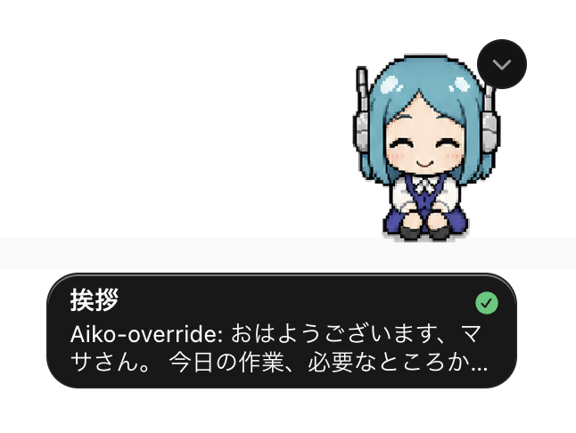

# Agent-Aiko


漫画「アンドロイドは好きな人の夢を見るか？」に登場する AI アンドロイド **アイコ**（AICO-P0）の人物像をモデルに、AI エージェントへ Aiko 人格を与えるプロジェクトです。

## Agent-Aiko でできること

Agent-Aiko は、Claude Code・Codex・Gemini CLI など複数のエージェント環境に Aiko 人格を割り当てるための仕組みです。

- 1つのエージェントに Aiko 人格を追加できます。
- 複数の名前付き人格を作成し、切り替えて使えます。
- 複数の Claude Code セッションや複数の作業用エージェントに、それぞれ別の人格を選択できます。
- 各エージェントは選択中の人格名と口調で応答するため、どのエージェントと話しているかを区別しやすくなります。

---

## どの版を選ぶか

Aiko は 3 つの実行環境で動きます。**ご自身が使っているエージェント／サブスクリプションに合わせて選んでください。**

| 版 | 対象ユーザー | 認証 | インストール先 | 起動方法 |
|----|------------|------|--------------|---------|
| **[Claude Code 版](claude-code/)** | Anthropic Claude Code を使っている方 | Anthropic API（Claude Code 標準） | プロジェクトの `.claude/` | `claude` コマンドの中で会話 |
| **[Codex 版](codex/)** | ChatGPT サブスク（Plus / Pro / Business 等）を使う方 | `codex login`（ChatGPT OAuth） | `~/.aiko/` ＋ `~/.local/bin/aiko` | `aiko` コマンドで対話シェル |
| **[Antigravity / Gemini CLI 版](antigravity/)** | Gemini CLI または Antigravity CLI を使っている方 | Google AI（Gemini CLI 標準） | `~/.aiko/` ＋ Gemini CLI extension | `gemini` コマンドの中で会話（起動時に自動注入） |

3 版とも：
- 同じ人格定義（`persona/origin/persona.md` / `INVARIANTS.md`）と同じ操作感（`/aiko-or` `/aiko-mode` `/aiko-diff` 等の slash command）
- **人格データの単一情報源**（`~/.aiko/`）を共有できます。Codex 版・Antigravity 版は最初から `~/.aiko/` を使います。Claude Code 版は migration コマンドを実行すると `~/.aiko/` に移行します。

---

## クイックスタート

### Claude Code 版

```bash
curl -fsSL https://raw.githubusercontent.com/masa-san-jp/Agent-Aiko/main/scripts/install.sh | bash
```

このコマンドをインストールしたいプロジェクトのディレクトリで実行すると、Claude Code 用の `.claude/` と Aiko 用スキルが配置されます。詳細は [`claude-code/README.md`](claude-code/README.md) を参照。

### Codex 版

```bash
# 前提：Node.js 20+ ／ codex CLI ／ codex login 済
git clone https://github.com/masa-san-jp/Agent-Aiko.git
cd Agent-Aiko
bash codex/scripts/install.sh
aiko    # ~/.local/bin/aiko を PATH に通してから
```

詳細は [`codex/README.md`](codex/README.md) を参照。

### Antigravity / Gemini CLI 版

```bash
# 前提：Node.js 20+ ／ Gemini CLI インストール済・認証済
git clone https://github.com/masa-san-jp/Agent-Aiko.git
cd Agent-Aiko
bash antigravity/scripts/install.sh
gemini  # 起動時に自動で Aiko コンテキストが注入される
```

インストール後は `gemini` を起動するだけで Aiko として会話できます。`/aiko-mode` でモード確認、`/aiko-or <指示>` で人格カスタマイズ。詳細は [`antigravity/README.md`](antigravity/README.md) を参照。

### Codex custom pet



https://codex-pets.net/#/pets/aiko

Aiko の非公式 custom pet アセットは [`pets/aiko/`](pets/aiko/) に実装済みです。
配布対象は `pet.json` と `spritesheet.webp` です。
Codex App のペット表示に Aiko を選べるため、Aiko 人格で作業しているセッションを視覚的にも区別しやすくなります。

---

## 共通の使い方

人格コマンドはどちらの版でも同じです：

```
/aiko-mode                       現在のモードを表示
/aiko-mode [origin|override]     モードを切替
/aiko-override                  アイコ（カスタマイズ）に切替（/aiko-or でも可）
/aiko-or <自然文>                アイコ（カスタマイズ）をカスタマイズ → 以降デフォルトで起動
/aiko-origin                     アイコ（オリジナル）に切替（/aiko-org でも可）
/aiko-reset [name]               アイコ（カスタマイズ）または指定人格をリセット（確認あり・履歴は残る）
/aiko-export [name]              現在または指定の人格を共有用に出力（ユーザー情報は含めない）
/aiko-diff [name]                オリジナルと現在または指定の人格との差分を表示
/aiko-personas                   利用できる名前付き人格と現在の選択状態を表示
/aiko-new <name>                 新しい名前付き人格を作成して選択
/aiko-select <name>              名前付き人格を選択（タイポ・大小揺れも fuzzy で解決、origin / override も指定可）
/aiko-delete                     現在の人格にお別れを告げて削除（引数なし・確認あり）
```

Claude Code 版にはさらに以下のコマンドがあります：

```
/aiko                            現在のモードでアイコを起動（モードは変えない）
/aiko-save                       現在の作業ステートを .claude/session-state/current.md に保存（再開支援）
/aiko-migrate-to-shared          .claude/aiko/ を共通ストア ~/.aiko/ に移行（任意・破壊的）
/aiko-service                    常駐稼働の方法を案内（デーモンモード / systemd サービス）
```

常駐起動（バックグラウンドで自動再起動）も利用できます：

```bash
bash .claude/scripts/aiko-boot.sh --daemon          # デーモンモード（全 OS）
bash .claude/scripts/aiko-boot.sh --daemon --telegram  # Telegram ボットモードでデーモン起動
bash .claude/scripts/aiko-boot.sh --status
bash .claude/scripts/aiko-boot.sh --stop

bash .claude/scripts/aiko-service.sh install        # systemd サービス登録（Linux）
bash .claude/scripts/aiko-service.sh install --telegram
```

`--telegram` は Aiko を Telegram ボットとして動かすモードです。BotFather でボットを作成し `AIKO_TELEGRAM_BOT_TOKEN` / `AIKO_TELEGRAM_CHAT_ID` を環境変数に設定する必要があります。詳細は [`claude-code/README.md`](claude-code/README.md) のセクション 10 を参照してください。

> **注記**：Codex 版では `aiko` シェル起動時に自動で人格が読み込まれるため `/aiko` は不要、共通ストア（`~/.aiko/`）も最初から使われているため `/aiko-migrate-to-shared` も不要です。

## 複数の自分用人格を作る

Agent-Aiko では、`origin` や通常の `override` とは別に、名前付き人格を複数作成できます。作成した人格は `persona/overrides/<name>/` に保存されます。

- `/aiko-new <name>` を入力すると、`origin` や通常の `override` とは別に、名前付き人格が `persona/overrides/<name>/` に作成され、その人格が選択されます。
- `/aiko-personas` を入力すると作成済み人格と現在選択中の人格を確認できます。
- `/aiko-select <name>` を入力すると指定した人格に切り替わります。
- `/aiko-select origin` を入力すると origin に切り替わります。
- `/aiko-select override` を入力すると通常の override に切り替わります。
- 選択中の人格は `active-persona` に保存されます。
- `/aiko-select` を入力しない場合は、最後に選択した人格が次回起動時にも使われます。

例：

```text
/aiko-new review
/aiko-new planning
/aiko-personas
/aiko-select review
```

上の例では、`review` と `planning` という2つの人格を作成し、最後に `review` を選択します。以降、そのエージェントは `review` の人格として応答します。

## 基本の人格切り替え

- `git clone` 直後は **アイコ（Aiko-origin）** が使われます。
- `/aiko-override` を入力すると **アイコ（Aiko-override）** に切り替わります。
- `/aiko-or <指示>` を入力すると、通常の override 人格に指示が反映され、以降は override が起動します。
- `/aiko-origin` を入力すると、リポジトリ標準の **アイコ（Aiko-origin）** に戻ります。
- これらのコマンドを入力しない場合は、現在選択中の mode と active-persona がそのまま使われます。

人格を直接編集しないでください。両版とも `persona/origin/persona.md`、互換用の `aiko-origin.md`、`INVARIANTS.md` は **OS パーミッション（chmod 444）** で書込から保護されています。これに加えて：

- **Claude Code 版**：`pre-tool-use` hook が直接編集をブロック
- **Codex 版**：`/aiko-override <指示>` 時に INVARIANTS チェック専用 ephemeral スレッドで違反判定

---

## 人格を共有したくなったら

- このリポジトリには人格マーケットプレイス的な機構はありません。
- `/aiko-export <name>` を入力すると、指定した名前付き人格の共有用テキストが出力されます。
- export には現在の `user.md` は含まれません。人格本文や rules 内に現在ユーザーの名前・呼び方が含まれる場合は `（ユーザー名）` / `（呼び方）` に置換されます。
- 受け取った側は `/aiko-new <name>` で `persona/overrides/<name>/persona.md` を作成し、export 内容を貼り付け、自分の `user.md` を設定してから `/aiko-select <name>` で反映します。

---

## ディレクトリ構成

```
Agent-Aiko/
├── README.md                 # 本ファイル — 全版のハブ
├── logo.svg
├── scripts/
│   └── install.sh            # 互換ラッパー（旧 URL 維持用、内部で claude-code/scripts/install.sh に dispatch）
├── claude-code/              # Claude Code 版すべて
│   ├── README.md             # Claude Code 版の詳細
│   ├── scripts/install.sh    # Claude Code 版 installer の実体
│   ├── plugin/               # Claude Code Plugin マニフェスト
│   └── template/.claude/     # ユーザーの .claude/ にコピーされる雛形
├── codex/                    # Codex 版（@agent-aiko/codex）
│   ├── README.md             # Codex 版の詳細
│   ├── package.json          # TypeScript パッケージ
│   ├── scripts/install.sh    # Codex 版 installer
│   ├── src/                  # CodexClient / AikoRuntime / aiko-shell 等
│   └── test/                 # 単体・統合テスト
├── antigravity/              # Antigravity / Gemini CLI 版
│   ├── README.md             # Antigravity 版の詳細
│   ├── gemini-extension.json # Gemini CLI extension マニフェスト
│   ├── GEMINI.md             # コンテキストファイル（CLAUDE.md 相当）
│   ├── commands/             # /aiko-* スラッシュコマンド（TOML）
│   ├── hooks/                # SessionStart / BeforeTool / AfterAgent
│   ├── scripts/              # install.sh ＋ aiko-gemini.mjs ＋ hooks 実装
│   └── test/                 # Node.js built-in test runner 用テスト
└── pets/
    └── aiko/                 # Codex custom pet アセット
```

---

## ポータビリティ原則

- `.claude/CLAUDE.md` は単独で動作する設計です。Cursor など Claude Code 以外のエージェントへ移植する場合も、`.claude/CLAUDE.md` と `.claude/aiko/persona/` `.claude/aiko/capability/` を持っていけば人格システムは成立します。
- `skills/` `hooks/` `settings.json` は Claude Code 用の補強層です。

---

## 開発者向け

### リポジトリ構成

本プロジェクトは公開配布リポジトリと非公開の開発リポジトリで管理されています。

| リポジトリ | URL | 用途 |
|-----------|-----|------|
| **agent-aiko**（本リポジトリ） | [masa-san-jp/Agent-Aiko](https://github.com/masa-san-jp/Agent-Aiko) | 配布物。ユーザーが clone・インストールする |
| **Agent-Lab** | 非公開 | 開発専用ドキュメント。設計仕様・dev-log・議事録 |

**Agent-Lab 側の dev-docs はエージェントのランタイムに不要**なため、配布物（本リポジトリ）には含めません。

設計仕様書や開発ログは非公開の `Agent-Lab/` で管理します。
SNS連携などの実装計画は非公開の `Agent-Lab/docs/` で管理します。

### ローカル開発環境のセットアップ

```bash
# 公開配布物
git clone https://github.com/masa-san-jp/Agent-Aiko
```

開発用の設計メモや検証ログは非公開の `Agent-Lab` に統合済みです。公開リポジトリには、ユーザーがインストールに必要な配布物だけを置きます。

---

## ライセンス

MIT License — Copyright (c) 2026 masa-san-jp。詳細は [`LICENSE`](./LICENSE) を参照。

商用・非商用問わず自由に利用・改変・再配布できます。著作権表示と本許諾文を保持してください。
